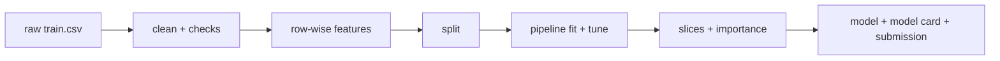
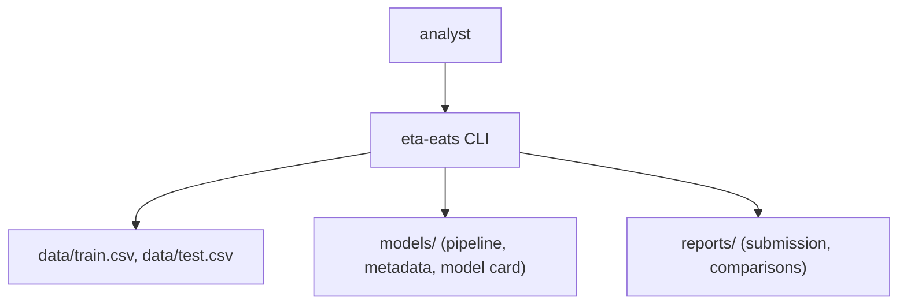
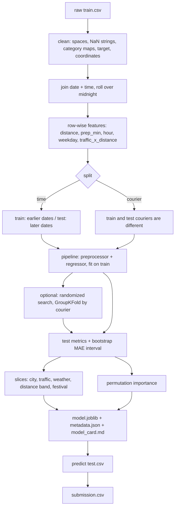

<div align="center">

# eta-eats — Food Delivery Time Prediction

**eta-eats is a regression pipeline for food delivery teams that need a delivery time estimate. It takes a raw delivery file through these steps to a tested model, a model card and a submission file:**

`clean with checked category maps` → `add row-wise features` → `split by time or courier` → `fit one pipeline` → `tune with grouped folds` → `score by slice` → `predict the test file`.


**[Summary](#1-summary)** ·
**[Workflow](#4-the-end-to-end-workflow)** ·
**[Run it](#10-how-to-run-eta-eats)** ·
**[Configuration](#104-environment-variables)** ·
**[Known problems](#13-known-problems)** ·
**[Glossary](#15-glossary)**

</div>

> [!NOTE]
> This README uses ASD-STE100 Simplified Technical English. The writing rules and the project
> vocabulary are in [`docs/ste-style-guide.md`](docs/ste-style-guide.md). Each term in the
> [Glossary](#15-glossary) has only one meaning.

---

eta-eats predicts the delivery time of a food order in minutes from the courier, the distance, the traffic, the weather and the time of day. The main idea is that every feature reaches the model through one tested path. A category map rejects unknown values. Row-wise features have no fitted state. One sklearn pipeline is fitted on the training rows only. The tuned model is the model that the evaluation scores and saves.

This README is the **one location that explains all of eta-eats**. It gives these topics:

- the general design
- each component and its procedure, step by step
- the decision rules
- the data map
- the runbook
- the validation results and the known problems

| If you are… | Read |
|---|---|
| A manager or reviewer | [1](#1-summary), [3](#3-design-rules), [4](#4-the-end-to-end-workflow), [12](#12-validation-results), [14](#14-key-points) |
| A developer who joins the project | All sections, in sequence. Keep [10](#10-how-to-run-eta-eats) and [13](#13-known-problems) open while you work |
| An operator who runs eta-eats | [10](#10-how-to-run-eta-eats), then the section for the component that you use |

---

## Table of contents

1. 🧭 [Summary](#1-summary)
2. 🏗️ [How eta-eats is built](#2-how-eta-eats-is-built)
   - 2.1 [Components](#21-components)
   - 2.2 [System context](#22-system-context)
   - 2.3 [Repository layout](#23-repository-layout)
3. 🛡️ [Design rules](#3-design-rules)
4. 🔄 [The end-to-end workflow](#4-the-end-to-end-workflow)
   - 4.1 [Full flow](#41-full-flow)
   - 4.2 [The life cycle of one training run](#42-the-life-cycle-of-one-training-run)
5. 🔵 [Data cleanup and row-wise features](#5-data-cleanup-and-row-wise-features)
6. 🟢 [Splits, pipeline and models](#6-splits-pipeline-and-models)
7. 🟣 [Evaluation, model card and prediction](#7-evaluation-model-card-and-prediction)
8. ⚖️ [Decision rules and thresholds](#8-decision-rules-and-thresholds)
9. 🗂️ [Data and file map](#9-data-and-file-map)
10. ▶️ [How to run eta-eats](#10-how-to-run-eta-eats)
    - 10.1 [Prerequisites](#101-prerequisites) · 10.2 [Installation](#102-installation) · 10.3 [Run eta-eats](#103-run-eta-eats) · 10.4 [Environment variables](#104-environment-variables)
11. 🧩 [How to extend eta-eats](#11-how-to-extend-eta-eats)
12. ✅ [Validation results](#12-validation-results)
13. ⚠️ [Known problems](#13-known-problems)
14. 📌 [Key points](#14-key-points)
15. 📖 [Glossary](#15-glossary)
16. 📄 [License](#16-license)

---

## 1. Summary

**The problem.** A delivery time model is only as good as its features and its test. These are the difficult questions:

- Does every traffic level, including `Jam`, reach the model?
- Is the preparation time correct when the pick-up is after midnight?
- Does any statistic of the test rows leak into the training step?
- Is the scored model the tuned model?
- Does the model work for new couriers and for later dates?
- Which inputs matter, and does the importance table use the correct names?

eta-eats gives each of these questions its own component and its own tests.

| Item | Value |
|---|---|
| Input | The Kaggle `train.csv` and `test.csv` files, or synthetic files in the same format |
| Output | A saved pipeline, `metadata.json`, `model_card.md`, slice metrics, permutation importance, a submission CSV |
| Components | **6**: cleaner, row-wise features, splits, model pipelines, evaluation, prediction |
| Providers | None. LightGBM is an optional extra |
| Offline mode | Everything. `eta-eats demo` generates data and runs the full workflow |
| Safety | Unknown category values stop the run. The preprocessor sees training rows only |
| Tests | **32** unit tests (`pytest`), 1 skipped without the `lightgbm` extra |



---

## 2. How eta-eats is built

### 2.1 Components

| Component | Module | Purpose |
|---|---|---|
| Cleaner | `src/eta_eats/clean.py` | Column contract, category maps, target parsing, coordinates, roll-over, data quality report |
| Row-wise features | `src/eta_eats/features.py` | Distance, preparation time, hour, weekday, interaction, the preprocessor |
| Loading and splits | `src/eta_eats/data.py` | `prepare`, `load`, time, courier and random splits |
| Models | `src/eta_eats/models.py` | Five pipelines, an optional LightGBM pipeline, the randomized search |
| Evaluation | `src/eta_eats/evaluate.py` | MAE, RMSE, R², MAPE, bootstrap interval, slices, permutation importance |
| Training and prediction | `src/eta_eats/train.py` | Fit and score, compare, save, model card, submission |
| Synthetic data | `src/eta_eats/synthetic.py` | Raw-format files with the Kaggle quirks |
| CLI | `src/eta_eats/cli.py` | The `eta-eats` command |

### 2.2 System context



### 2.3 Repository layout

```
eta-eats/
├── src/eta_eats/
│   ├── clean.py          # category maps, target, coordinates, roll-over
│   ├── features.py       # row-wise features, preprocessor
│   ├── data.py           # prepare, load, splits
│   ├── models.py         # pipelines and tuning
│   ├── evaluate.py       # metrics, slices, importance
│   ├── train.py          # fit, compare, save, model card, predict
│   ├── synthetic.py      # raw-format synthetic files
│   └── cli.py            # eta-eats command
├── tests/                # 32 pytest tests, synthetic data only
├── data/README.md        # source, columns, known values
├── docs/ste-style-guide.md
├── .github/workflows/ci.yml
└── pyproject.toml
```

---

## 3. Design rules

### 3.1 Checked category maps
`clean.py` removes spaces and changes the string `NaN` to a missing value. Every category must be in its known set. An unknown value raises `DataQualityError`. The traffic map is `Low 0, Medium 1, High 2, Jam 3`, and a check confirms that the map adds no missing value.

### 3.2 One path for every feature
`features.add_features` adds all row-wise features to the same frame that `model_input` gives to the pipeline. A test checks that each feature name appears in the fitted preprocessor output.

### 3.3 Correct times
`clean.py` joins `Order_Date` with each time. If the pick-up is earlier than the order, the pick-up moves to the next day. Preparation times below 0 or above 120 minutes become missing values.

### 3.4 No leakage
Row-wise features use one row only. The imputer, the scaler and the one-hot encoder are inside the pipeline, so they are fitted on the training rows only.

### 3.5 The tuned model is the final model
`models.tune` uses `RandomizedSearchCV` with `refit=True` and courier-grouped folds. `train.fit_and_score` scores and saves `best_estimator_`. A test compares the saved parameters with the best parameters.

### 3.6 Correct names in diagnostics
`evaluate.importance` runs permutation importance on the whole pipeline with the model input columns. The names in the table are the names of the shuffled columns.

### 3.7 No identifier as a feature
The courier ID and the delivery ID are not inputs. The courier city from the courier ID is an input.

### 3.8 Seeds and a held-out benchmark
All splits and models take a seed. The `time` split tests on later dates. The `courier` split tests on other couriers. `eta-eats predict` scores the Kaggle `test.csv` in the submission format.

### 3.9 A portable package
The package has a CLI, local relative paths, environment variables and no notebook-only steps. The core needs NumPy, pandas, scikit-learn and joblib.

---

## 4. The end-to-end workflow

### 4.1 Full flow



### 4.2 The life cycle of one training run

1. Read the raw file as text.
2. Clean the columns and check every category.
3. Add the row-wise features.
4. Split the rows with the chosen split.
5. Fit the pipeline on the training rows, or tune it with grouped folds.
6. Score the test rows and calculate the bootstrap interval of the MAE.
7. Calculate the slice metrics and the permutation importance.
8. Save the pipeline, the metadata, the slices, the importance and the model card.

---

## 5. Data cleanup and row-wise features

**Purpose.** Change the raw file into typed columns and correct features.

| Input | Output |
|---|---|
| A raw CSV file | A clean frame with row-wise features, a data quality report |

**Procedure**

1. Check that all 19 input columns exist. A training file also needs `Time_taken(min)`.
2. Remove spaces and change `NaN` strings to missing values.
3. Remove the prefix `conditions` from the weather values.
4. Check each category against its known set.
5. Change the target text `(min) 24` to the number 24 with a regular expression.
6. Make negative coordinates positive. Make coordinates below 1 degree missing.
7. Make ratings outside 1 to 5 missing.
8. Join the order date with the order time and the pick-up time. Roll over pick-ups after midnight.
9. Calculate the distance, the preparation time, the order hour, the weekday and `traffic_x_distance`.

**Rules**

- The order hour comes from the order time. If the order time is missing, it comes from the pick-up time.
- The courier city is the letters before `RES` in the courier ID.

| Feature | Formula |
|---|---|
| `distance_km` | Haversine distance, Earth radius 6371.0088 km |
| `prep_min` | Pick-up time minus order time, in minutes |
| `order_hour` | Hour plus minutes / 60 |
| `weekday` | Monday 0 to Sunday 6, from `Order_Date` |
| `traffic_level` | Low 0, Medium 1, High 2, Jam 3 |
| `traffic_x_distance` | `traffic_level` × `distance_km` |

---

## 6. Splits, pipeline and models

**Purpose.** Fit a model that generalizes to later dates and to new couriers.

| Input | Output |
|---|---|
| The clean frame | A fitted pipeline, the tuning table |

**Procedure**

1. Split the rows. The default is the `time` split: the latest 20 % of order dates are test rows.
2. Make the pipeline: the preprocessor plus one regressor.
3. The preprocessor imputes numeric columns with the median and adds missing-value indicators. Then it scales them.
4. It imputes categorical columns with `missing` and one-hot encodes them. Values with fewer than 20 rows join one group.
5. If you give `--tune`, the randomized search tries `--n-iter` settings of the `gbm` pipeline with 5 courier-grouped folds.
6. The search refits the best setting on all training rows. That pipeline is the final model.

**Rules**

- The `courier` split puts each courier in the training rows or in the test rows, never in both.
- The tuning uses the training rows only.

| Model | Regressor |
|---|---|
| `median` (baseline) | `DummyRegressor(strategy="median")` |
| `ridge` | `Ridge(alpha=1.0)` |
| `random_forest` | 200 trees, `min_samples_leaf=5` |
| `gbm` | `HistGradientBoostingRegressor`, 400 iterations, learning rate 0.1 |
| `mlp` | `MLPRegressor(64, 32)`, early stopping, seeded |
| `lightgbm` (optional extra) | `LGBMRegressor`, 500 trees, learning rate 0.05 |

---

## 7. Evaluation, model card and prediction

**Purpose.** Tell how good the model is, for which deliveries, and give predictions for new deliveries.

| Input | Output |
|---|---|
| The fitted pipeline, the test rows, a file without a target | Metrics, slices, importance, `model_card.md`, `submission.csv` |

**Procedure**

1. Calculate MAE, RMSE, R², MAPE and the share of predictions within 5 minutes.
2. Calculate the 95 % bootstrap interval of the MAE over the test rows.
3. Calculate the MAE and the RMSE for each slice.
4. Calculate the permutation importance on up to 3,000 test rows with 5 repeats.
5. Save the model card with the intended use, the data, the metrics, the top inputs and the limits.
6. For `predict`, load the model and check that its features match this version.
7. Clean the new file without a target, predict and write `ID` and `Time_taken (min)`.

**Rules**

- Predictions below 0 become 0.
- A saved model with other features stops `predict` with a message.

---

## 8. Decision rules and thresholds

| Rule | Value | Code |
|---|---|---|
| Missing value strings | `NaN`, `nan`, empty | `clean.py` |
| Valid rating | 1 to 5 | `clean.py` |
| Valid coordinate | Absolute value of 1 degree or more | `clean.py` |
| Valid preparation time | 0 to 120 minutes | `clean.py`, `features.py` |
| Roll-over | Pick-up earlier than the order: add 1 day | `clean.py` |
| Test share | 20 % (time: latest dates, courier: groups, random: rows) | `data.py` |
| Rare category | Fewer than 20 training rows: one group | `features.py` |
| Tuning | `n_iter` 20 (CLI default), 5 GroupKFold folds, MAE | `models.py` |
| Bootstrap | 1,000 draws, 95 % percentile interval | `evaluate.py` |
| Distance bands | 0-3, 3-6, 6-10, 10-15, 15+ km | `evaluate.py` |
| Importance | 5 repeats, up to 3,000 rows, MAE increase | `evaluate.py` |

**Responsible use.** The estimate is for planning and for customer messages. Do not use it to judge, rank or pay a courier. The data can have bias by city and by vehicle type. Check the slice table before you use a model in a new city.

---

## 9. Data and file map

| Path | Committed? | Contents |
|---|---|---|
| `data/README.md` | Yes | Source, columns, known values |
| `data/train.csv`, `data/test.csv`, `data/Sample_Submission.csv` | No (git ignores it) | Kaggle files or synthetic files |
| `models/model.joblib` | No (git ignores it) | The fitted pipeline |
| `models/metadata.json` | No (git ignores it) | Model, features, split, seed, metrics, tuning, versions |
| `models/model_card.md` | No (git ignores it) | Intended use, data, metrics, top inputs, limits |
| `models/slices.csv`, `models/importance.csv` | No (git ignores it) | Slice metrics, permutation importance |
| `reports/submission.csv` | No (git ignores it) | Predictions for the test file |
| `.env.example` | Yes | Variable names only |

---

## 10. How to run eta-eats

### 10.1 Prerequisites

| Need | For |
|---|---|
| Python 3.11+ | All components |
| The Kaggle files (see [`data/README.md`](data/README.md)) | Results on real data |
| `lightgbm` (extra `lightgbm`) | Only the `lightgbm` model |

### 10.2 Installation

```bash
git clone https://github.com/KrishnaAnnavaram/eta-eats.git
cd eta-eats
python -m venv .venv
. .venv/bin/activate            # Windows: .venv\Scripts\activate
pip install -e ".[dev]"
pip install -e ".[lightgbm]"    # optional
```

### 10.3 Run eta-eats

Run the offline demo first. It uses synthetic data only.

```bash
eta-eats demo --out reports/demo
```

Run each step on the Kaggle files.

```bash
eta-eats synth --out data --rows 6000                        # synthetic files in the raw format
eta-eats clean --data data/train.csv                         # data quality report
eta-eats clean --data data/test.csv --no-target
eta-eats compare --data data/train.csv --split time --out reports/compare_time.csv
eta-eats compare --data data/train.csv --split courier
eta-eats train --data data/train.csv --model gbm --split time --tune --n-iter 20 --out models
eta-eats predict --model-dir models --input data/test.csv --out reports/submission.csv
pytest -q
```

| Command | What it does |
|---|---|
| `synth` | Writes synthetic `train.csv`, `test.csv` and `Sample_Submission.csv` |
| `clean` | Prints the data quality report and the traffic counts |
| `compare` | Fits all models on one split and prints the metrics with the MAE interval |
| `train` | Fits (or tunes) one model, scores it and saves the model, the metadata and the model card |
| `predict` | Scores a file without a target and writes the submission |
| `demo` | Synthetic files, two comparisons, a tuned model, importance, slices and a submission |

### 10.4 Environment variables

| Variable | Used by | Meaning |
|---|---|---|
| `ETA_EATS_DATA_DIR` | `clean`, `train`, `compare` | Folder of `train.csv` when `--data` is not given, default `data` |
| `ETA_EATS_MODEL_DIR` | `train`, `predict` | Model folder, default `models` |
| `ETA_EATS_OUTPUT_DIR` | `predict` | Folder of `submission.csv`, default `reports` |
| `ETA_EATS_SEED` | `train`, `compare` | Seed when `--seed` is not given, default `42` |

eta-eats needs no credentials. Keep local settings in a `.env` file. Git ignores this file.

---

## 11. How to extend eta-eats

| You want to… | Do this | Code change? |
|---|---|---|
| Accept a new category value | Add it to `DOMAINS` in `clean.py` | Small |
| Add a row-wise feature | Calculate it in `add_features` and add its name to `NUMERIC` or `CATEGORICAL` | Small |
| Add a model | Add a branch to `_regressor` and a name to `MODELS` | Small |
| Tune another model | Add a search space and call `RandomizedSearchCV` like `tune` | Small |
| Add a slice | Add the column name to `SLICES` in `evaluate.py` | Small |
| Serve predictions | Load `model.joblib` and call `prepare` and `model_input` before `predict` | Yes |

---

## 12. Validation results

All results below come from `pytest` and from `eta-eats demo` with seed `42`. The demo results use **synthetic data**: 6,000 generated training deliveries and 1,500 generated test deliveries. They are not results on the Kaggle data.

| Validation | Result | Command |
|---|---|---|
| Unit tests | **32 passed**, 1 skipped (LightGBM not installed) | `pytest -q` |
| Data quality (synthetic) | 6,000 rows, 53 sign fixes, 382 invalid coordinates, 32 roll-overs, 85 missing traffic values, 0 unknown categories | `eta-eats demo` |
| Time split MAE in minutes (synthetic) | `gbm` 2.59 (2.45 to 2.75), `mlp` 2.75, `random_forest` 2.82, `ridge` 3.46, `median` 9.06 | `eta-eats demo` |
| Courier split MAE in minutes (synthetic) | `gbm` 2.76 (2.61 to 2.92), `mlp` 2.92, `random_forest` 2.98, `ridge` 3.59, `median` 9.07 | `eta-eats demo` |
| Tuned `gbm`, time split (synthetic, 8 settings) | MAE 2.50, cross-validated MAE 2.59, R² of the untuned `gbm` 0.88 | `eta-eats demo` |
| Top permutation importance (synthetic) | `distance_km` 4.37 min, `traffic_x_distance` 3.87 min, `traffic_level` 0.64 min | `eta-eats demo` |
| MAE by traffic level (synthetic) | Jam 1.61, High 2.08, Medium 2.87, Low 3.17 | `eta-eats demo` |

The synthetic delivery time comes from a known formula with a traffic × distance effect. The importance table finds that effect, so the interaction feature reaches the model. The courier split gives a higher MAE than the time split, as expected for new couriers. The prototype reported scores from a different, leaky setup. They are not reproduced here.

---

## 13. Known problems

Read these problems before you use eta-eats in production.

| # | Area | Problem | Impact and action |
|---|---|---|---|
| 1 | Validation | CI uses synthetic data. Results on the 45,593 Kaggle deliveries are not reproduced here | Run `eta-eats compare` and `eta-eats train --tune` on the Kaggle files |
| 2 | Synthetic data | The synthetic formula is simpler than real deliveries | Do not compare synthetic MAE values with real MAE values |
| 3 | Coordinates | Coordinates below 1 degree become missing, and the distance is imputed | Deliveries with bad coordinates get a weaker estimate |
| 4 | Time | The dataset covers about 8 weeks. Seasonal effects are not in the data | Retrain with data from more months before long-term use |
| 5 | Tuning | Only the `gbm` model has a tuning search. The demo uses 8 settings | Use `--n-iter 20` or more on real data |
| 6 | Explainability | Permutation importance only. No SHAP values | Correlated inputs (distance and the interaction) share their importance |
| 7 | LightGBM | The optional model is not tested in CI | Run the skipped test with `pip install -e ".[lightgbm]"` |
| 8 | Fairness | The model is not checked for effects on couriers | Do not use the estimate to judge couriers |

---

## 14. Key points

1. **Every traffic level reaches the model.** The category map includes `Jam`, and unknown values stop the run.
2. **Preparation time is correct after midnight.** Pick-ups roll over to the next day.
3. **One pipeline, fitted on training rows only.** No statistic of the test rows leaks.
4. **The tuned model is the saved model.**
5. **Importance names are correct.** They come from the shuffled input columns.
6. **The tests use later dates or new couriers.**
7. **The Kaggle test file gets a submission.**

---

## 15. Glossary

| Term | Meaning |
|---|---|
| **Baseline** | The `median` model, which predicts the median delivery time |
| **Category map** | The fixed set of known values for one categorical column |
| **Courier** | The person who delivers, with a courier ID |
| **Courier city** | The city code at the start of the courier ID |
| **Data quality report** | The counts that the cleaning step prints |
| **Delivery** | One row of a raw file |
| **Delivery time** | The target: minutes from the order to the delivery |
| **Distance** | The Haversine distance in kilometres from the restaurant to the customer |
| **Fold** | One part of the courier-grouped cross-validation |
| **Interaction** | The feature `traffic_x_distance` |
| **Model card** | The file with the intended use, data, metrics and limits |
| **Permutation importance** | The increase of the test MAE when one input column is shuffled |
| **Pipeline** | The preprocessor plus the regressor, fitted on training rows only |
| **Preparation time** | Minutes from the order time to the pick-up time |
| **Preprocessor** | The `ColumnTransformer` for imputation, scaling and one-hot encoding |
| **Raw file** | A Kaggle CSV file before cleaning |
| **Roll-over** | A pick-up time earlier than the order time, moved to the next day |
| **Row-wise feature** | A feature that uses the values of one row only |
| **Slice** | A group of test rows with one value of one column |
| **Split** | The division into training rows and test rows |
| **Submission** | The CSV file with `ID` and the predicted `Time_taken (min)` |
| **Synthetic data** | Generated files. They are not real deliveries |
| **Traffic level** | Low 0, Medium 1, High 2, Jam 3 |
| **Tuned model** | The refitted best pipeline of the randomized search |

---

## 16. License

[MIT](LICENSE) © 2026 Krishna Annavaram
